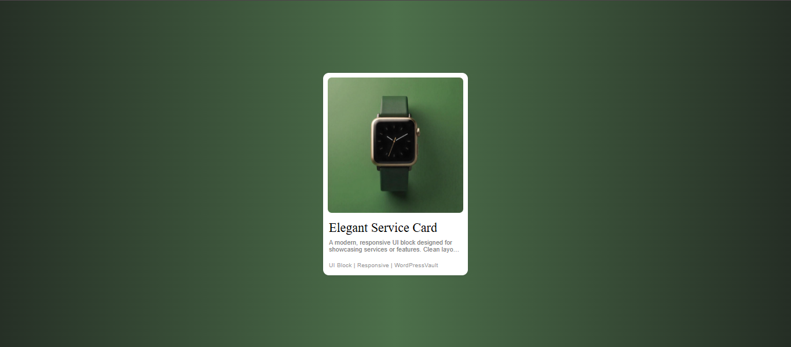
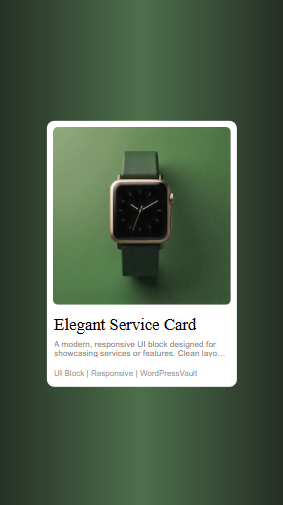
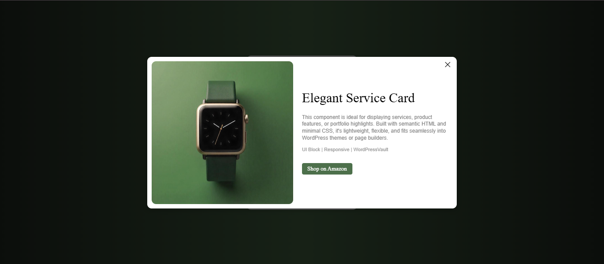
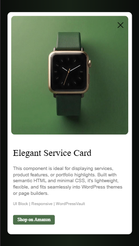

# Component 01 – Card With Popup

A clean, responsive product card component featuring an image, short description, and keyword tags. Clicking the card opens a popup modal with extended details and a "Shop on Amazon" button.

---

## Features

* Fully responsive design
* Custom popup with overlay
* Embedded Amazon/shop button
* Optimized for copy-paste integration into WordPress
* Built-in styling and interaction via HTML, CSS, and JavaScript

---

## Use Cases

* Product listings for affiliate marketing
* Featured products in WooCommerce stores
* Showcase cards for digital or physical goods

---

## How to Use

### ⚙️ Step 1: Add Styles

Copy the CSS block starting from:

```css
/*-- Style sheet for this component --*/
```

And paste it into your custom CSS file.

### ✅ Step 2: Insert the HTML

Copy the HTML body (starting from `<a class="carousel-link">...</a>` and the popup `<div class="popup">...</div>`) into your WordPress block with fully Java Script code (starting from `<script>` to `</script>`)

You can insert this inside:

* A Custom HTML block
* A container component

---

### 🧐 Notes

* Replace image links (e.g., `src="..."`) with your own image URLs.
* Update the `data-amazon-link` attribute and the Shop button with your actual product/shop URLs.
* Change the `popupID` in both `data-popup-id` and `id` to ensure uniqueness when reusing this component multiple times.

---

## Visual Examples

### Card Image (Web)



### Card Image (Mobile)



### Popup View (Web)



### Popup View (Mobile)



